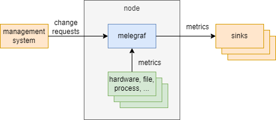
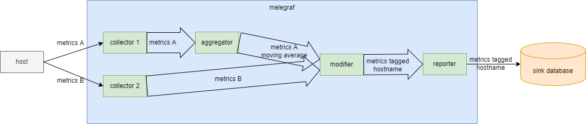

# Melegraf

Melegraf is an agent for collecting, processing, aggregating, and writing metrics. It was inspired by [telegraf](https://github.com/influxdata/telegraf), which is based on a plugin system to enable developers to easily add support for additional metric collection. However, telegraf has an stationary procedure to handle metrics. If the configuration is changed, telegraf will reload the configuration and reorganize its plugins. This will cause telegraf to stop collecting metrics for a while.

To make metric handling procedure more flexible, melegraf allows users to configure a number of processors that work on metrics and a number of conveyors that transfer metrics between processors. Users can organize processors and conveyors in whatever way they want. This design was inspired by a computer game [Dyson Sphere Program](https://store.steampowered.com/app/1366540/Dyson_Sphere_Program/), which allows players to build a factory to produce items. The factory is composed of a number of buildings, and each building has a number of input and output ports. Players can organize buildings in whatever way they want to produce items.

## How it works

Melegraf runs as a daemon process in a node. The node could be a host, a virtual machine or a container. Melegraf collects metrics from a number of sources, processes metrics, and writes metrics to a number of sinks. There may be a management system sends requests to melegraf to change its configuration. Melegraf will reload its configuration and reorganize its processors and conveyors while keeping the unchanged ones working.

The building blocks of melegraf are processors and conveyors. A processor processes one or many metrics when its ticker ticks or it receives some metrics from input conveyors. After finished processing, the processor sends the processed metrics to its output conveyors or external sinks. A conveyors transfers metrics from its input processor to its output processor. A processor can have multiple input conveyors and multiple output conveyors. A conveyor can have only one input processor and one output processor.

Usually, a melegraf instance consists of some collecting processors to collect metrics, some intermediate processors to modify or aggregate metrics, and some reporting processors to report metrics to external sinks. The processors are connected by conveyors. The following figure shows a melegraf instance that collects metrics from a host, processes metrics, and reports metrics to a database.

## Environment requirements

## Get started

## Learn more
